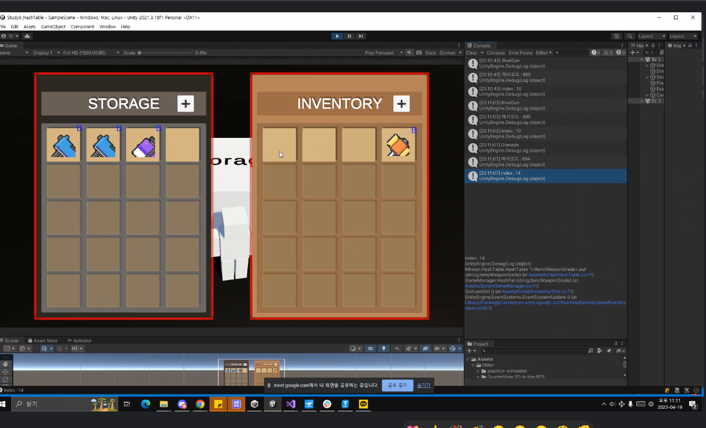

# 2023.04.19 TIL

## Study
### Algorithm
- 백준 문제풀이 [부분수열의 합](https://www.acmicpc.net/problem/1182)
- 알고리즘 스터디 - 해시 테이블, 오등큰수, 후위표기식 발표 
### SQL
- 프로그래머스 SQL 문제풀이 [NULL 처리하기](https://school.programmers.co.kr/learn/courses/30/lessons/59410)
- 프로그래머스 SQL 문제풀이 [나이 정보가 없는 회원 수 구하기](https://school.programmers.co.kr/learn/courses/30/lessons/131528)
### JAVA
- Optional [블로깅](https://memodayoungee.tistory.com/121)
### React
- 포트폴리오 모바일에서의 가로 스크롤 에러 수정
## Reflection
- 오늘 데일리코딩에서 powerSet에 대한 문제를 풀었던 이유로 복습하는 차원에 백준에서 관련 문제를 풀었다. stack을 활용해서 문제를 풀긴했지만, 시간면에서 다른 사람들에 비해 너무 느렸다. 그래서 다른 사람들의 문제풀이를 확인했다.
```java
 private static void fun(int depth, int sum) {
        if (depth == N) {
            if (sum == S) {
                ans++;
            }
            return;
        }

        fun(depth + 1, sum + arr[depth]);
        fun(depth + 1, sum);
    }
```
한 문제 더 풀고 싶지만 곧 스터디를 해야해서 생략..
- SQL은 레벨 1, 2문제라 어려움은 없었음
- 드디어 포트폴리오 사이트에 있었던 오류들을 전부 해결했다. 헤더부분의 오류는 어떤 문제인지 진작에 알고 있었기 때문에 금방해결했지만, 모바일에서 가로 스크롤이 생겨 기능적으로 번거로웠던 문제는 근본적인 원인을 해결하지 못했다. 어떤 문제인지는 알고있으나 css지식이 부족해서 방법을 찾지못했다. 결국 데스크탑 환경에서는 파도 효과를 사용하고, 모바일 환경에서는 파도효과를 없애는 방법으로 조치를 취했다.. 모달은 언제끝내지.. 
- 스터디원 중 유니티를 공부하시는 분이 있는데 해시테이블 예제를 유니티로 짜와서 다들 감탄했다.. 아직도 잊히지 않아서 사진 첨부함..
- 코드스테이츠 스프링파트를 공부 중, Optional이라는 것을 알게되었다. 잘 알지 못하는 개념이라 공부할 겸 블로깅했다. 
- 포트폴리오 페이지 오류를 수정하느라 오늘 스프링은 공부하지 못했다... 내일 다시 열심히 달려야지 ㅠ 다시 토비의 스프링을 읽어볼 예정
## Tommorow I'll Learn
- **[스프링]** 직접 로그인 구현해보기
- **[스프링]** 토비의 스프링 1권 150p까지 읽기
- **[알고리즘]** 알고리즘 1문제 풀기
- **[SQL]** 프로그래머스 1문제 풀기


