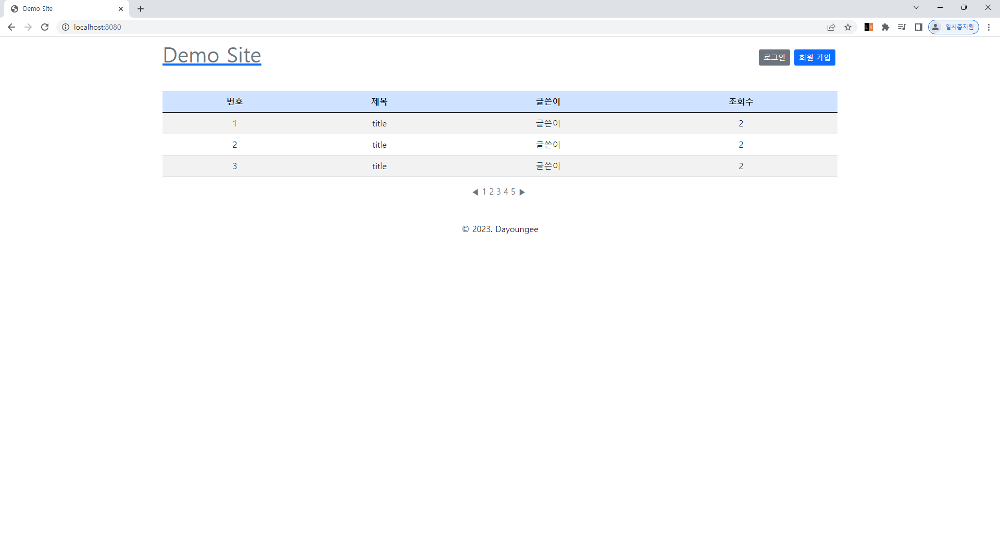

# 2023.04.20 TIL

## Study
### Algorithm
- 백준 알고리즘 문제풀이 [로봇 청소기](https://www.acmicpc.net/problem/14503)
### SQL
- 프로그래머스 SQL 문제풀이 [조건에 맞는 도서와 저자 리스트 출력하기](https://school.programmers.co.kr/learn/courses/30/lessons/144854)
- 프로그래머스 SQL 문제풀이 [상품 별 오프라인 매출 구하기](https://school.programmers.co.kr/learn/courses/30/lessons/131533)
### Spring
- 토이프로젝트 세팅
## Reflection
- 알고리즘 문제풀이는 문제 자체가 이해되지 않아서 이해하는데 오랜 시간이 걸렸다.. 알고리즘 문제만 붙잡고 있으면 안될 것 같아서 내일 다시 풀어볼 생각이다.
- Join 절에서 항상 On으로 같아야할 값을 비교했는데, 그럴 필요없는 Using이 있다는 것을 알았다.
- 이전에 게시판 구현했던 프로젝트에 로그인을 붙히려는데 디자인이 예쁘지 않아 토이 프로젝트라고 들이밀기에도 창피해서 처음부터 다시 만들기로 했다.. 초기 세팅, 홈 컨트롤러 구현, 홈 View까지 구현된 상태이다. View 꾸미기에 너무 시간을 들인 나머지 게시판은 시작조차 못했다..
지금 하려는 토이프로젝트는 SpringBoot, Thymeleaf, JPA, Spring Security를 사용할 예정이다.
- 
```mysql
SELECT BOOK_ID, AUTHOR_NAME, DATE_FORMAT(PUBLISHED_DATE,'%Y-%m-%d') as PUBLISHED_DATE
FROM AUTHOR as a
JOIN BOOK as b
USING(AUTHOR_ID)
WHERE b.CATEGORY='경제'
ORDER BY b.PUBLISHED_DATE;
```
## Tommorow I'll Learn
- **[스프링]** 게시판 구현, 시간되면 페이징까지
- **[스프링]** 토비의 스프링 200p
- **[알고리즘]** 알고리즘 1문제 풀기
- **[SQL]** 프로그래머스 1문제 풀기

