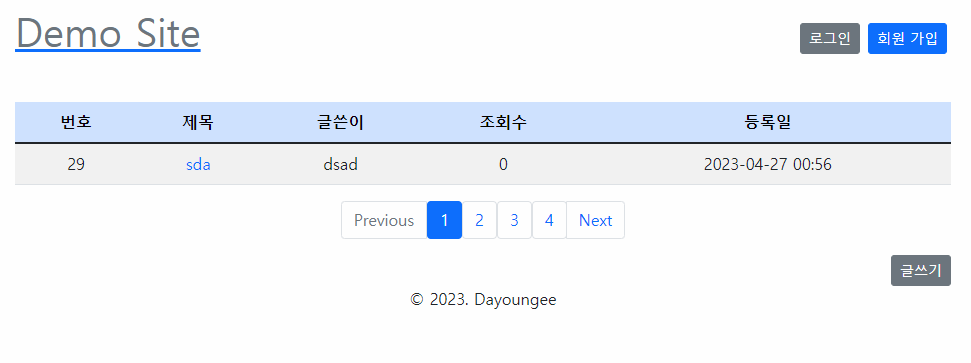

# 2023.04.26 TIL

## Study
### SQL
- 프로그래머스 문제 풀이 [있었는데요 없었습니다](https://school.programmers.co.kr/learn/courses/30/lessons/59043)
### Spring
- 토이프로젝트
    - JPQL -> QueryDSL 변경
    - 페이징 구현 
## Reflection
- 의외로 Join문제는 어렵지 않게 풀어내는 중..
- 오늘 객체지향 스터디인 줄 알았는데 알고리즘 스터디였다. 그래서 오늘 알고리즘 문풀은 스킵
- pageable을 control단에서 받아와 nextPage와 prevPage를 구현했다. 의외로 뷰쪽으로 보내야될 데이터가 많아 객체로 빼서 필요한 데이터를 모아놓았다.
이게 맞는 방법인지는 모르겠지만, 소스가 한결 깔끔해졌다.
- 페이지를 4개씩 나눠놨는데 3페이지를 확인하면 [1234] 7페이지를 확인하면 [5678] 이런식으로 보여주고 싶어서 애를 좀 많이 먹었다.(이런 방법은 구글에서도 안나옴)
뷰쪽에서 현재 페이지를 서버에 보내면, 서버는 현재 페이지를 토대로 시작번호와 끝번호를 계산해서 인덱스를 배열에 담아 뷰로 보내는 방법으로 구현했다.
- 내일 시간이 되면 코드 스테이츠에서 배웠던 예외처리도 적용해볼 생각이다. 로그인 구현단계에 들어가면 검증까지 해볼 생각이다.
## Tommorow I'll Learn
- **[스프링]** 게시글 검색 구현
- **[OOP]** 10시 스터디 참여
- **[SQL]** 1문제 풀기
- **[알고리즘]** 1문제 풀기

