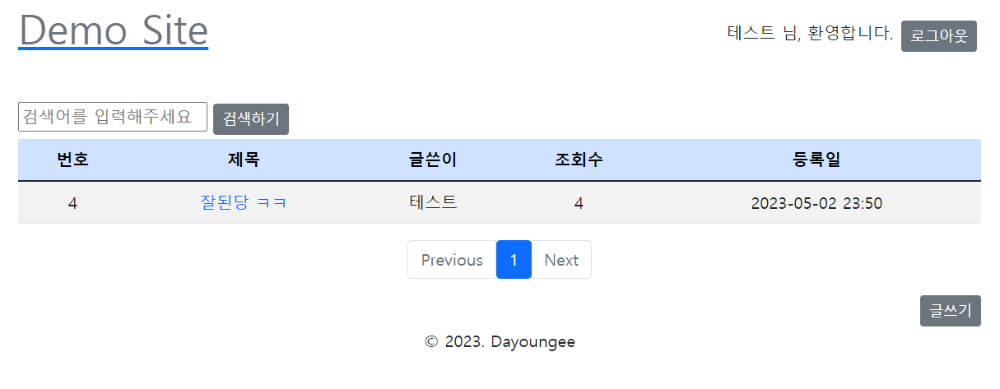

# 2023.05.02 TIL

## Study
### SQL
- 프로그래머스 문제 풀이 [루시와 엘라 찾기](https://school.programmers.co.kr/learn/courses/30/lessons/59046)
### Algorithm
- 프로그래머스 문제 풀이 [다리를 지나는 트럭](https://school.programmers.co.kr/learn/courses/30/lessons/42583?language=java)
### Spring
- 토이프로젝트
    - 로그인, 회원가입, 로그아웃 구현 

## Reflection
- SQL 문제는 쉬웠음
- 다리를 지나는 트럭은 코드스테이츠에서 풀었던 문제와 유사했는데도 불구하고 머리가 안돌아가 답지를 봐버림.. 3일뒤에 다시 풀 예정
- 게시판구현은 타임리프쪽 말고는 사실 어려움 점이 없었는데 스프링 시큐리티를 적용한 로그인, 회원가입 구현은 너무너무넌무너문너무 어려웠다.. 시큐리티도 이번으로 3번째 보는 개념이라
조금씩 이해는 간데도 스스로 구현하라고 하면 어려움이 있을 것 같다.. 내일 다시 복습을 해야겠다.
## Tommorow I'll Learn
- **[스프링]** 로그인, 회원가입, 로그아웃 복습 및 시간 남으면 예외처리
- **[스프링]** 스터디 내용 정리하기
- **[SQL]** 1문제 풀기
- **[알고리즘]** 1문제 풀기

- https://www.acmicpc.net/source/59905031 분석하기

